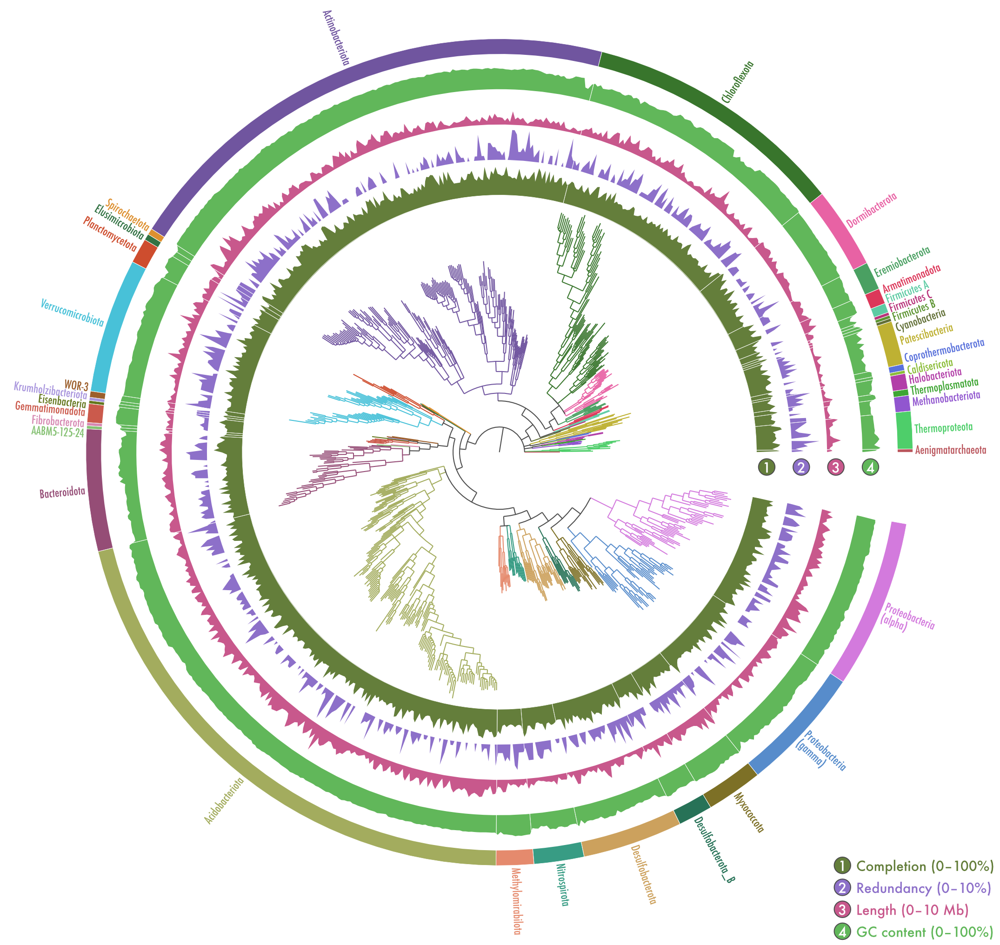

# Kilpisjarvi-MAGs



Bioinformatics workflow used in the article:

> Pessi IS, Viitamäki S, Virkkala A-M, Eronen-Rasimus E, Delmont TO, Marushchak ME, Luoto M, Hultman J. 2022. In-depth characterization of denitrifier communities across different soil ecosystems in the tundra. Environmental Microbiome 17: 30. doi: [10.1186/s40793-022-00424-2](https://doi.org/10.1186/s40793-022-00424-2).

## Contacts

**Igor S Pessi**  
Postdoctoral Researcher  
[E-mail](mailto:igor.pessi@gmail.com)

**Jenni Hultman**  
Principal Investigator  
[E-mail](mailto:jenni.hultman@helsinki.fi)

## Table of contents

1. [Pre-processing of raw data](01-pre-processing.md)
2. [Metagenome assembling](02-assembling.md)
3. [Binning of MAGs](03-MAG-binning.md)
4. [Gene-centric analyses](04-gene-centric.md)
5. [Working with MAGs](05-working-with-MAGs.md)

## Before starting

### You will need to have these softwares installed and in your path

* SRA Toolkit v2.11.3: https://github.com/ncbi/sra-tools/
* fastQC v0.11.9: http://www.bioinformatics.babraham.ac.uk/projects/fastqc/
* multiQC v1.8: https://multiqc.info/
* Cutadapt v1.16: https://cutadapt.readthedocs.io/
* Porechop v0.2.4: https://github.com/rrwick/Porechop/
* seqtk v1.3: https://github.com/lh3/seqtk/
* METAXA v2.2: https://microbiology.se/software/metaxa2/
* mothur v1.44.3: https://mothur.org/
* MEGAHIT v1.1.1.2: https://github.com/voutcn/megahit/
* metaFlye v2.7.1: https://github.com/fenderglass/Flye/
* bowtie v2.3.5: http://bowtie-bio.sourceforge.net/bowtie2/
* SAMtools v1.9: http://www.htslib.org/
* pilon v1.23: https://github.com/broadinstitute/pilon/
* metaQUAST v5.0.2: http://bioinf.spbau.ru/metaquast/
* anvi’o v6.2: https://merenlab.org/software/anvio/
* CoverM v0.6.1: https://github.com/wwood/CoverM/
* KofamScan v1.3.0: https://github.com/takaram/kofam_scan/
* MAFFT v7.429: https://mafft.cbrc.jp/alignment/software/
* FastTree v2.1.11: http://www.microbesonline.org/fasttree/
* GTDB-Tk v1.3.0 and GTDB release 05-RS95: https://gtdb.ecogenomic.org/
* dbCAN v.2.0: https://github.com/linnabrown/run_dbcan/

We have used an Atos BullSequana X400 system running the Red Hat Enterprise Linux Server 7.7 (Maipo).  
You should be able to run the analysis with any UNIX-based OS.

### Define number of threads to use

You should change below to the number of cores available in your system:

```bash
NTHREADS=40
```

### Get sample metadata

We have prepared a metadata file that will help us downloading the FASTQ files and running some of the scripts.  
You should download it [here](sample_metadata.tsv) and move it to where you will be running the analyses.